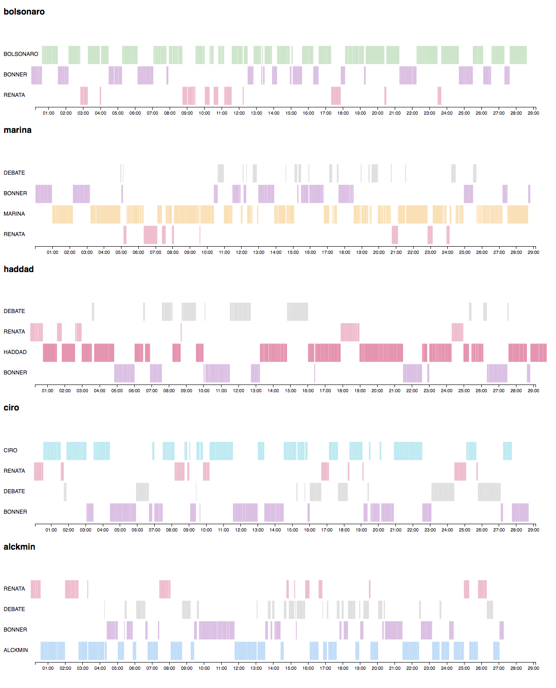

parlezy
===

So here's a tool that should enable you to just drop video/audio files from conversations and get useful information about it. such as:

* Speaker Diarization - who's speaking at each continuous segment/interval;
* Speaker Gender;
* Intervals duration;
* Data viz showing timeline separation between speakers;

Sample viz from the analysis of several video files:

Dependencies
===

You're supposed to have installed:

* ffmpeg (TODO: show how to install)
* Java 1.8 + 
* Pentaho Data Integration - just run `install_pdi.sh` (TODO: implement) and you'll be good to go

Usage
===

Say you've one or more files you'd like to analyze, a tv interview for instance. 

Custering
---

You'll drop it into the `videos/` folder - even if it's just an audio file - and run
`main.sh` (TODO: implement and explain params. Currently: `<PDI FOLDER>/kitchen.sh -file=./etl/main.kjb`).

This script will

* Run through each video file inside of the `videos/` folder - make sure there's only videos there;
* Generate for each input file:
    - `data/$input_filename/ctl/$input_filename.ctl` a timed segmentation with clusters of speakers;
    - `data/$input_filename/ctl/$input_filename.csv` a structured csv with roughly the same data as the `ctl` with some more calculated fields;
    - `data/$input_filename/clusters/$CLUSTER_NAME/$n.$extension` for each (cluster, segment) found within the audio file - this helps identify speakers later on;

Identifying
---

Afterwards, In order to identify which person speaks on each cluster, you must visit each `data/$input_filename/clusters/$CLUSTER_NAME` and edit the folder name replacing the keyword `SPEAKER` for the name of the person on the dialogue. Once that's done, it's time to do the publishing.

Publishing
---

To generate useful compiled files with data over all the conversations and publish visualizations, you should then run `publish.sh` (TODO: implement and explain params. Currently: `<PDI FOLDER>/kitchen.sh -file=./etl/publish.kjb`)

This workflow will

* Build and publish an Analysis model to Pentaho Server
* Export `output/output.csv` with the compiled data and speaker identification;
* Publish `output/timeline.html` with one timeline with speaker identification for each input file provided.

Improving the output
---

The speaker diarization tool could be trained to obtain better results, but alternatively, parlezy comes with a tool that helps identifying gaps longer than a provided `threshold`.

Running `gaps.sh 2` (TODO: implement and explain params. Currently: `<PDI FOLDER>/kitchen.sh -file=./etl/gaps.kjb -param:INTERVAL_THRESHOLD=2`) will identify each empty interval - with no speaker assigned - longer than 2 seconds and:
* Generate cluster folders and their respective vide/audio files into the `data/$input_filename/clusters/` folder;
* Append these intervals to the source of the `publish` workflow - so you can rename the folders to identify who's speaking and then run the `publish` workflow again to get the gaps filled.

#### Correcting a GAP

So in an attempt to identify gaps that have not been assigned to a speaker, we just append lines into the `ctl` and into the `csv` files and generate the corresponding videos to those continuous intervals. 

If you're verifying a video and notice that a gap doesn't belong to one person only, you should open the `csv` and the `ctl` files and:
* From the gap video, take note of the start and end moments in seconds (e.g. 431.54 and 439.90);
* Correct the corresponding lines to the gap you're analyzing into the two flat files - `csv` and the `ctl`;
* Run the `gaps` workflow again.

This will generate new gap lines on these files as well as cluster folders with their video sections.

(TODO: isolate and parametrize the db output option)

(TODO: isolate and parametrize the pentaho output option)

(TODO: implement scripts for downloading samples and running examples)

(TODO: make this doc appealing)

(TODO: Generate issues for TODO's)